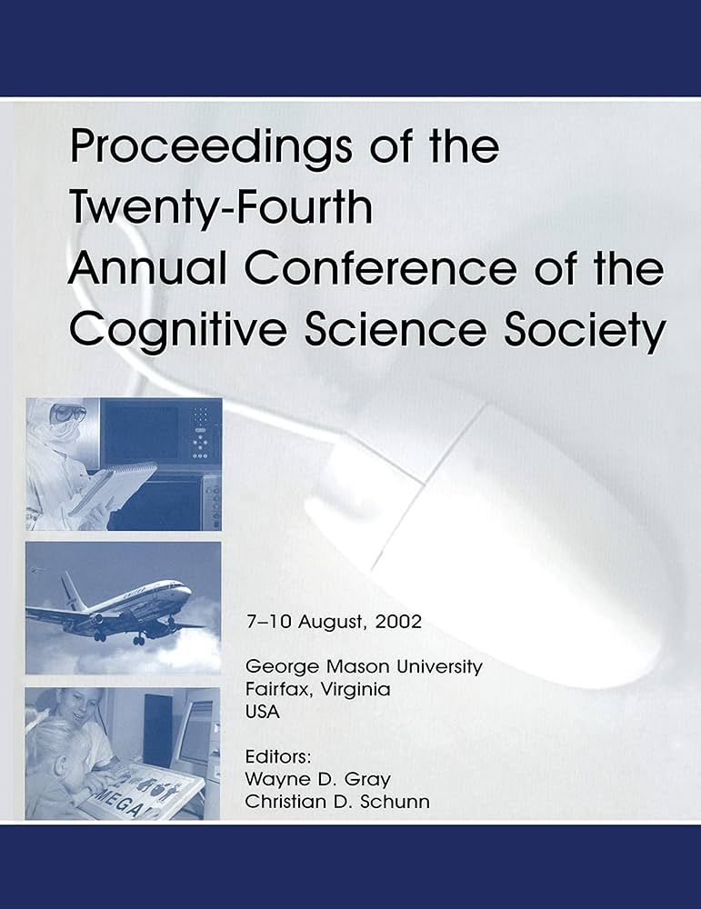
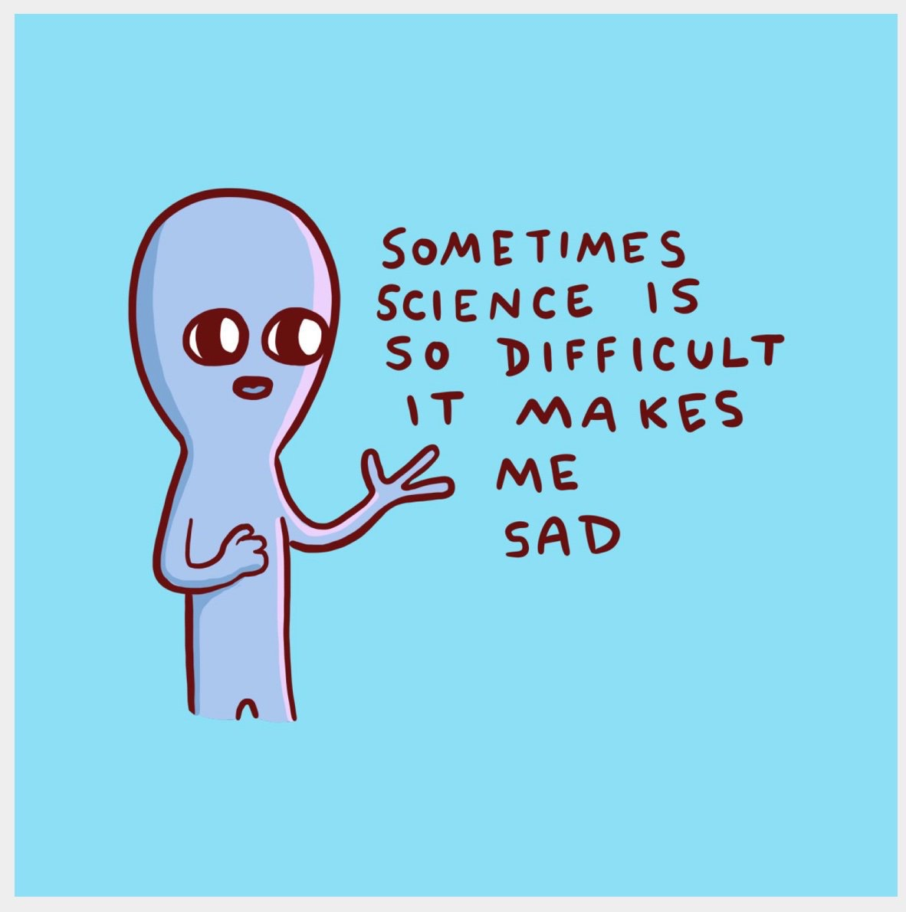

## *Outline*

* Mengapa publikasi ilmiah penting?
* Moda komunikasi kesarjanaan & jenis artikel
* Lanskap jurnal ilmiah: Mengenal penerbit dan pangkalan data ilmiah (*scientific database*)
* Mewaspadai jurnal/penerbit pemangsa
* Bagaimana proses penerbitan ilmiah bekerja?
* Struktur naskah ilmiah (IMRAD)
* Naskah yang layak terbit
* Latihan menulis: *elevator pitch*

# Mengapa publikasi itu penting? {background-color="#14497F" .center}

## Lebih dari sekadar kewajiban administratif

::: {.incremental}
* Publikasi adalah cara pengetahuan **disebarluaskan, diuji, dan dikritisi** oleh komunitas ilmiah
* **Tanggung jawab moral** peneliti — temuan yang tidak dipublikasikan adalah pengetahuan yang "hilang"  Ingat, apa dampak *publication bias*❓
* **Bukan** digunakan untuk mengukur/menunjukkan "kapasitas pribadi" peneliti, tetapi sebagai **evaluasi** atas klaim yang diajukan oleh peneliti
  - Oleh karena itu, kritik *reviewer* dan editor jangan dianggap sebagai sesuatu yang personal
* Memupuk *academic ethos*  [***organized skepticism***](https://www.bitss.org/education/mooc-parent-page/week-1/introduction-to-research-transparency-and-the-scientific-ethos/mertons-norms-and-the-scientific-ethos/)
  - Klaim tidak mudah diterima begitu saja, harus diverifikasi dan di*scrutinize* seketat mungkin
  - Oleh karena itu, riset (dan *eventually*, naskah publikasi) yang baik harus bisa dicoba-ulang (*replicate*) dan direka-ulang (*reproduce*) oleh tim peneliti yang lain ([Nosek, et al., 2022](https://www.annualreviews.org/content/journals/10.1146/annurev-psych-020821-114157))
* **Langkah pertama** sebelum menulis adalah mengenali lanskap publikasi ilmiah dan memilih _outlet_ yang dituju untuk publikasi
:::

## Yang terjadi kalau kita salah memilih _outlet_...

::: {.incremental}
* Naskah diterbitkan di jurnal palsu/pemangsa, akibatnya:
  * **Reputasi** tercederai — siapapun yang namanya tercantum: mahasiswa maupun promotor
  * Merupakan indikasi bahwa peneliti memilih **jalan instan** (padahal keseluruhan prosesnya umumnya tidak mudah)
  * **Mempersulit karir** dalam jangka panjang — baik karir akademik maupun karir struktural
  * Khilaf satu-dua kali, *that's okay*. Tapi kalau berulang, bisa ditengarai ada kemungkinan ketidakjujuran
:::

::: {.callout-warning}
### Penting untuk memilah _outlet_ 
Oleh karena itu, **memilah jurnal adalah proses yang sangat penting** dan akan kita bahas lebih lanjut di sesi ini.
:::

# Moda komunikasi & jenis artikel {background-color="#14497F" .center}

## Moda komunikasi kesarjanaan

::: {.columns}
::: {.column width="60%"}

::: {.incremental}
Karya ilmiah dapat dikomunikasikan dalam berbagai bentuk:

* **Monograf & bab buku** (*edited book*) — relevan khususnya di bidang humaniora dan ilmu sosial
  - *Magnum opus* ilmuwan-ilmuwan yang berpengaruh dari bidang sosial-humaniora biasanya berupa monograf
* ***Pre-print*** — versi naskah *sebelum ditinjau sejawat (peer-review)*, diunggah ke server terbuka (e.g., [PsyArXiv](https://osf.io/preprints/psyarxiv), [MetaArXiv](https://osf.io/preprints/metaarxiv), [arXiv](https://arxiv.org/), dsb.)
* ***Post-print*** — versi naskah yang sudah ditinjau sejawat tetapi belum ditata letak sesuai gaya selingkung (_in-house style_) penerbit terbitan berkala ilmiah - bisa di*hosting* di *pre-print server* atau ResearchGate
:::

:::
::: {.column width="40%"}

{fig-align="center" width="90%"}

:::
:::

## Moda komunikasi kesarjanaan

::: {.columns}
::: {.column width="60%"}

::: {.incremental}
Karya ilmiah dapat dikomunikasikan dalam berbagai bentuk:

* ***Conference paper*** / *proceedings* — presentasi di konferensi; berguna untuk membangun jaringan tetapi tidak selalu ditinjau sejawat
  - Moda utama untuk sejawat di _computer_ dan _cognitive science_
* **Artikel ilmiah yang diterbitkan di jurnal** — melalui proses tinjauan sejawat; yang paling diinginkan dalam karir akademik, utamanya di Psikologi
:::

:::
::: {.column width="40%"}

{fig-align="center" width="80%"}

:::
:::

## Jenis artikel ilmiah 1️⃣ 

::: {.incremental}
**Berbasis data primer**

* ***Original research*** (artikel empiris)
  - Pendek – satu atau dua studi
  - Panjang – *multiple studies article* – bisa 4-12 studi dalam satu artikel
  - Artikel replikasi (_registered replication reports_ (RRR, [Simons, et al., 2014](https://journals.sagepub.com/doi/10.1177/1745691614543974)))
  - Artikel dengan protokol yang terdaftar sebelumnya (_preregistered studies_)
  - Penelitian simulasi - biasanya di psikometri atau *mathematical psychology*
* ***Brief/short communication***
* ***Case study/report***
* [***Registered Report***](https://www.cos.io/initiatives/registered-reports) ⭐ — desain & hipotesis dinilai *reviewer* **sebelum** data dikumpulkan dan dianalisis
:::

## Jenis artikel ilmiah 2️⃣ 

::: {.incremental}
**Berbasis literatur (sekunder)**

* ***Meta Studies***
  - _Scoping review_, _systematic review_, _meta analysis_
* ***Narrative review*** / *conceptual paper*
* ***Methodological paper***
  - Tutorial, _book review_, _data paper_
* ***Target article***
  - _Target article_ <i class="fa-solid fa-circle-arrow-right"></i> _Commentary_ <i class="fa-solid fa-circle-arrow-right"></i> _Rejoinder_
  - Biasanya _highly citable_ tetapi… kadang-kadang menjadi sumber “drama” karena memantik kontroversi dan debat yang ekstrim
  - Cenderung “spekulatif” tetapi biasanya banyak dibaca orang karena mengandung “prediksi teoritis.”
:::

## Registered reports ([Chambers, 2015](https://onlinelibrary.wiley.com/doi/abs/10.1111/add.12728))

::: {.columns}
::: {.column width="60%"}

::: {.incremental}
* Inovasi terbaru penerbitan ilmiah
  - Peneliti diminta untuk submit perencanaan studi/protokol (sebelum pengambilan data) untuk kemudian ditinjau sejawat di tahap satu.
  - Setelah lolos tinjauan sejawat tahap satu ("_accepted in principle_"), kemudian peneliti mengambil data dan melaporkan temuannya.
  - Setelah itu, artikel ditinjau di tahap kedua untuk diambil keputusan penerbitannya.
* Tujuannya, untuk memastikan penelitian benar-benar cermat secara ilmiah.
* Menghindari [_questionable research practices_](https://doi.org/10.1177/0956797611430953), seperti [_hypothesizing after results are known (HARK-ing)_](https://journals.sagepub.com/doi/10.1207/s15327957pspr0203_4).
* Ada [304 jurnal](https://docs.google.com/spreadsheets/d/1D4_k-8C_UENTRtbPzXfhjEyu3BfLxdOsn9j-otrO870/edit?gid=0#gid=0) yang menyediakan opsi RR dari berbagai disiplin; mulai dari psikologi, biomedis, manajemen, linguistik, biologi, ilmu politik, dsb.

:::
:::

::: {.column width="45%"}
{fig-align="center"}

:::
:::

# Lanskap jurnal ilmiah {background-color="#14497F" .center}

## Ekosistem pengetahuan ilmiah

::: {.incremental}
Tiga komponen utama:

* ***Publisher*/Penerbit** <i class="fa-solid fa-circle-arrow-right"></i> entitas komersial/non-profit yang menerbitkan jurnal (e.g., Elsevier, SAGE, Springer, Airlangga _University Press_, UC Press, dsb.)
* **Jurnal** (*standalone* atau di bawah naungan penerbit) <i class="fa-solid fa-circle-arrow-right"></i> tempat artikel diterbitkan
* **Pangkalan data ilmiah** (*scientific database*) <i class="fa-solid fa-circle-arrow-right"></i> basis data yang memungkinkan artikel ditemukan dan diakses, biasanya dilanggan oleh perpustakaan universitas
:::

::: {.callout-note}
#### Analogi sederhana 🐔🥚

* _Publisher_ = penerbit ↔️ produsen daging dan telur ayam
* Jurnal = *outlet* tempat artikel diterbitkan ↔️ rumah potong
* Artikel ilmiah ↔️ daging/telur ayam
* _Database_ = perpustakaan digital ↔️ supermarket yang menjual daging ayam
:::

## *Publisher*/penerbit besar

::: {.incremental}
Penerbit komersial yang dikenal luas:

* **Elsevier**, **Wiley**, **Springer/Nature**, **Taylor & Francis**, **SAGE**, **Oxford University Press**, **Cambridge University Press**
* Masing-masing menerbitkan ratusan hingga ribuan jurnal
* **Tidak semua jurnal** dari *publisher* besar otomatis berkualitas baik
* Ada penerbit kecil/independen yang reputasinya justru sangat kuat (e.g., [Brill](https://brill.com/?gad_source=1&gad_campaignid=22582347528))
* Di Indonesia: penerbit universitas (e.g., Airlangga _University Press_, UGM *Press*, dsb.)
:::

::: {.callout-note}
*Standalone journal* seperti [**Bijdragen tot de taal-, land- en volkenkunde / Journal of the Humanities and Social Sciences of Southeast Asia**](https://brill.com/view/journals/bki/bki-overview.xml) tidak dimiliki oleh *publisher* besar, tetapi "dianggap" bereputasi di kalangan ilmuwan studi kawasan Asia Tenggara. Ukuran penerbit tidak menentukan kualitas jurnal.
:::

## Pangkalan data (*database*)

::: {.incremental}
* **Scopus** <i class="fa-solid fa-circle-arrow-right"></i> basis data internasional paling umum digunakan di Indonesia (milik Elsevier)
* **Web of Science (WoS)** <i class="fa-solid fa-circle-arrow-right"></i> dianggap "lebih selektif" dari Scopus (milik Clarivate)
* **APA PsycNET** <i class="fa-solid fa-circle-arrow-right"></i> khusus literatur psikologi
* **PubMed** <i class="fa-solid fa-circle-arrow-right"></i> khusus literatur kesehatan
* **EBSCO**, **JSTOR** <i class="fa-solid fa-circle-arrow-right"></i> multi-disiplin
* **DOAJ** (*Directory of Open Access Journals*) <i class="fa-solid fa-circle-arrow-right"></i> khusus jurnal *open access*
* **SINTA** <i class="fa-solid fa-circle-arrow-right"></i> pangkalan data nasional (dikelola Kemdikbudristek)
* **Google Scholar** <i class="fa-solid fa-circle-arrow-right"></i> berguna untuk *mencari* artikel, umumnya **tidak digunakan** untuk mengklaim kualitas jurnal
:::

::: {.callout-warning}
#### Penting 
Terindeks di Scopus ≠ berkualitas baik. Tidak terindeks = **bisa jadi** sinyal untuk waspada.
:::

## *Open access* (OA) vs *non-OA journal*

::: {.incremental}
* ***Open access* (OA)**
  * Artikel bisa diakses bebas tanpa biaya langganan
  * Hak cipta (*copyrights*) **tetap** di tangan penulis
  * Penulis biasanya membayar *Article Processing Charge* (APC) <i class="fa-solid fa-circle-arrow-right"></i> **dibayar setelah naskah *accepted***

* ***Non-OA journal***
  * Pembaca membutuhkan biaya langganan yang mahal
  * Hak cipta (*copyrights*) **ditransfer** ke jurnal/penerbit
  * Biasanya tidak ada APC untuk penulis
:::

::: {.callout-note}
#### Penting diingat
Jenis akses **tidak berkaitan dengan kualitas**. Ada banyak jurnal OA yang sangat bagus dan banyak *non-OA journal* yang kualitasnya rendah.
:::

## Jurnal berdasarkan *open access policy*

| Jenis | APC | Lisensi | Contoh |
|---|---|---|---|
| **Gold OA** | Dibayar penulis (bisa mahal) | [<i class="fab fa-creative-commons"><i class="fa fa-universal-access"></i></i> BY 4.0](https://creativecommons.org/licenses/by/4.0/) | PLOS ONE, Frontiers |
| **Diamond OA** | Gratis untuk penulis & pembaca | [<i class="fab fa-creative-commons"><i class="fa fa-universal-access"></i></i> BY 4.0](https://creativecommons.org/licenses/by/4.0/) | sebagian jurnal universitas |
| **Green OA** | Tidak ada | Tergantung penulis, umumnya [<i class="fab fa-creative-commons"><i class="fa fa-universal-access"></i></i> BY 4.0](https://creativecommons.org/licenses/by/4.0/) | *preprint* di PsyArXiv/OSF |
| **Hybrid OA** | Opsional, perlu bayar kalau ingin artikel OA | Kalau OA, maka [<i class="fab fa-creative-commons"><i class="fa fa-universal-access"></i></i> BY 4.0](https://creativecommons.org/licenses/by/4.0/) | banyak jurnal Elsevier/Wiley |

: {tbl-colwidths="[15,40,20,25]"}

## Jurnal berdasarkan *open access policy*

::: {.incremental}

* Jurnal _hybrid_ sering dianggap model yang **paling tidak menguntungkan** peneliti 
* Penerbit mendapatkan pemasukan dari APC *dan* biaya langganan dari institusi ([*"double dipping"*](https://www.coalition-s.org/why-hybrid-journals-do-not-lead-to-full-and-immediate-open-access/)) 
* [*cOAlition S* atau *Plan S*](https://www.coalition-s.org/), yaitu koalisi *funder* Eropa yang mencakup Wellcome Trust dan banyak lembaga riset di Eropa (e.g., Deustche Forschungsgemeinschaft (DFG)), secara eksplisit **melarang publikasi di jurnal *hybrid*** kecuali ada *transformative agreement* antara institusi/konsorsium universitas dengan penerbit.
:::

# Waspada jurnal/penerbit pemangsa😼 {background-color="#14497F" .center}

## Karakteristik jurnal/penerbit pemangsa

::: {.incremental}
* Sebenarnya, istilah "jurnal/penerbit pemangsa" [sangat sulit didefinisikan](https://www.nature.com/articles/d41586-019-03759-y)
  - Intinya, jurnal/penerbit pemangsa ini didefinisikan sebagai "_entitas yang mengutamakan kepentingan pribadi/kelompok dengan **mengorbankan integritas** akademik dan ditandai oleh informasi yang salah atau menyesatkan, penyimpangan dari praktik editorial dan penerbitan terbaik, kurangnya transparansi, dan/atau penggunaan praktik pemasaran yang agresif dan tanpa pandang bulu_"
* Kadang tidak terindeks di pangkalan data manapun
  * Tapi, ada banyak jurnal yang praktiknya mirip "jurnal pemangsa" yang **terindeks Scopus dan/atau WoS (ESCI)**
* Penerbit tidak jelas dan cenderung **komersil**, tujuannya meraup keuntungan sebanyak-banyaknya, bukan mewadahi komunikasi kesarjanaan
* *Impact factor* jadi-jadian (bukan JIF resmi dari Clarivate)
* Tidak melakukan ***peer-review*** yang sesungguhnya, atau prosesnya sangat singkat dan sekadar formalitas
* Praktik-praktik [kontrak curang](https://www.frontiersin.org/journals/education/articles/10.3389/feduc.2018.00067/full) dalam publikasi ilmiah sudah sangat kompleks dari sekadar jurnal palsu/pemangsa
:::

## *Think. Check. Submit.*

{fig-align="center"}

::: {.incremental}
Tiga langkah **sebelum** memilih jurnal:

1. **Think** 🔴 <i class="fa-solid fa-circle-arrow-right"></i> apakah jurnal ini benar-benar cocok untuk topik naskah dan prospek karir saya ke depan?
2. **Check** 🟡 <i class="fa-solid fa-circle-arrow-right"></i> verifikasi identitas, proses editorial, dan reputasi jurnal
3. **Submit** 🟢 <i class="fa-solid fa-circle-arrow-right"></i> hanya setelah Anda yakin jurnal tersebut dikelola dengan baik dan sesuai dengan tujuan Anda

Lebih lengkap cek: [thinkchecksubmit.org](https://thinkchecksubmit.org/journals/)
:::

## Cara mengidentifikasi — cek dulu sebelum *submit*!

::: {.incremental}
* **Identitas jurnal**: apakah nama jurnal/penerbit familiar? Ada alamat pos yang valid?
* **ISSN**: cek di portal ISSN resmi ([portal.issn.org](https://portal.issn.org))
* **Cek kebijakan jurnal di _Open Policy Finder_**: cek kebijakan jurnal di [*Open Policy Finder*](https://openpolicyfinder.jisc.ac.uk/) (dulu SHERPA-RoMEO). Kalau jurnal terdaftar di laman terssebut, maka mungkin jurnal tersebut _legitimate_ (asli)
* **Editorial board**: apakah editor dan reviewer dikenal? Berafiliasi dengan institusi yang jelas?
* **Biaya**: apakah ada *submission charge* sebelum review? <i class="fa-solid fa-circle-arrow-right"></i> 🔴**RED FLAG**🔴
  * APC yang ditagih **setelah *accepted*** = normal di jurnal OA bereputasi
:::

## Cara mengidentifikasi — cek dulu sebelum *submit*!

::: {.incremental}
* **APC dan *waiver***: banyak jurnal OA bereputasi menyediakan *waiver* untuk penulis dari negara berpenghasilan menengah-bawah
  * Selalu **tanyakan *waiver*** jika tersedia
***Turnaround time***: berapa lama biasanya dari *submit* hingga keputusan pertama?
* **Transparansi**: apakah proses *peer-review* dijelaskan dengan jelas? Berapa lama biasanya jurnal memproses naskah (_turnaround time_)?
* **Komunikasi editorial**: apakah email selalu dijawab? Apakah ada kontak editorial yang jelas?
* **Konten**: baca beberapa artikel, lalu nilai apakah kualitasnya konsisten dan memadai?
:::

# Bagaimana jurnal bekerja? {background-color="#14497F" .center}

## Dari manuskrip ke publikasi 1️⃣

::: {.incremental}
1. **Submit** <i class="fa-solid fa-circle-arrow-right"></i> mendaftarkan naskah ke sistem jurnal (biasanya *online*)
2. ***Initial assessment*** <i class="fa-solid fa-circle-arrow-right"></i> editor memutuskan:
   * Apakah naskah sesuai *scope* jurnal?
   * Apakah kualitas awal memadai untuk dikirim ke *reviewer*?
   * Jika tidak, maka ***desk reject*** (biasanya dalam 1–2 minggu, tapi bisa lebih lama)
3. ***Peer-review*** <i class="fa-solid fa-circle-arrow-right"></i> naskah dikirim ke 2–3 (atau lebih) *reviewer* ahli di bidang yang relevan
:::

## Dari manuskrip ke publikasi 2️⃣

::: {.incremental}
4. **Keputusan editor** setelah *review*:
   * ***Major revision*** <i class="fa-solid fa-circle-arrow-right"></i> perlu revisi substansial, kemungkinan re-review
   * ***Minor revision*** <i class="fa-solid fa-circle-arrow-right"></i> revisi kecil, biasanya tidak perlu re-review
   * ***Rejection*** <i class="fa-solid fa-circle-arrow-right"></i> ditolak (tapi bukan akhir dunia!😉)
   * ***Accept*** <i class="fa-solid fa-circle-arrow-right"></i> langsung diterima tanpa revisi (sangat jarang)
5. **Revisi** <i class="fa-solid fa-circle-arrow-right"></i> penulis merespons masukan *reviewer* secara tertulis (*response to reviewers*)
6. **(Re-)review** <i class="fa-solid fa-circle-arrow-right"></i> kadang kembali ke *reviewer* untuk evaluasi revisi
7. ***Copyediting* & *proofreading***  **Terbit** (*published*)
:::

::: {.callout-note}
#### Waktu proses 
2 minggu (*desk reject*) hingga **12 bulan+** (sejak *submit* hingga terbit). _Turnaround time_ saat ini bisa lebih lama karena tren saat ini, editor kesulitan mencari _reviewer_.
:::

## *Desk rejection*

::: {.incremental}
* ***Desk rejection rate*** di jurnal bereputasi bisa mencapai **60–76%** ([Billsberry, 2014](https://journals.sagepub.com/doi/full/10.1177/1052562913517209))
  - Artinya: mayoritas naskah tidak pernah sampai ke tangan *reviewer*
* Penyebab utama *desk rejection*:
  * ***Scope* tidak sesuai** <i class="fa-solid fa-circle-arrow-right"></i> naskah tidak relevan dengan fokus jurnal
  * **Kualitas awal tidak memadai** <i class="fa-solid fa-circle-arrow-right"></i> tulisan tidak memenuhi standar jurnal, meskipun "standar" disini bisa jadi penilaian subjektif dari editor
  * **Format/teknis** <i class="fa-solid fa-circle-arrow-right"></i> tidak mengikuti *author guidelines*
  * **Bahasa** <i class="fa-solid fa-circle-arrow-right"></i> terutama hambatan bagi penulis non-penutur asli bahasa Inggris
:::

::: {.callout-warning}
#### Catatan penting ([Garand & Harman, 2021](https://www.cambridge.org/core/journals/ps-political-science-and-politics/article/abs/journal-deskrejection-practices-in-political-science-bringing-data-to-bear-on-what-journals-do/770D08D05782CC873E625E873815023A)) 
Peneliti dari negara non-berbahasa Inggris dan *early career researcher* lebih rentan terkena *desk rejection*. Harus disadari bahwa beberapa *desk rejection* adalah bentuk *gatekeeping* struktural dalam sistem publikasi ilmiah, yang hampir selalu merugikan peneliti dari kawasan selatan-selatan.
:::

## Siapa saja yang terlibat?

:::: {.columns}
::: {.column}
::: {.incremental}
**Editor** ingin...

* Naskah berkualitas yang **dibaca** banyak orang
* Konten yang **sesuai *scope*** jurnal
* Kontribusi yang **orisinal** (jika memungkinkan), atau setidaknya memadai

**Reviewer** ingin...

* Kontribusi ilmiah yang **memadai**
* Metodologi yang **kuat dan transparan**
* Argumentasi dipaparkan secara **jernih**, tidak bertele-tele
:::
:::
::: {.column}
::: {.incremental}
**Pembaca** ingin...

* Cepat menemukan informasi relevan <i class="fa-solid fa-circle-arrow-right"></i> *indexing*, *keywording*
* Temuan yang **bisa dipercaya** dan dapat dicoba-ulang (replikasi)
* Implikasi yang **jelas dan konkret**

**Penulis** ingin...

* Karyanya **disitasi** orang lain
* Kontribusi diakui komunitas ilmiah
:::
:::
::::

## Naskah yang baik — apa saja karakteristiknya?

::: {.incremental}
Kompromi antara semua pihak di _slide_ sebelumnya. Naskah yang baik:

* **Ide penelitian bisa jadi sederhana** tapi dieksekusi dengan desain penelitian yang baik
* Menyajikan **penjelasan yang langsung pada intinya** (*concise*), tidak berputar-putar yang membuat pembaca bingung
* Melakukan **eksplorasi yang menyeluruh** atas literatur yang relevan, ayng biasanya tampak di *state-of-the-art* yang dipaparkan di bagian *introduction*
* Menghasilkan **sintesis/diskusi dengan kontribusi keilmuan yang jelas**, bukan sekadar mendeskripsikan hasil statistik/wawancara
* Ditulis dengan **tata bahasa yang baik**
:::

## Struktur naskah ilmiah ([IMRAD](https://link.springer.com/article/10.1007/s10980-011-9674-3))

](libs/imrad.webp){fig-align="center"}

# Naskah yang layak terbit {background-color="#14497F" .center}

## Dua dimensi kualitas naskah

::: {.incremental}
Untuk menghasilkan naskah yang baik, perhatikan dua dimensi:

* **Konten**  terkait dengan:
  * Pertanyaan penelitian yang **jelas dan relevan**
  * Metode yang **sesuai dan dijelaskan dengan detail dan transparan** (sehingga bisa direplikasi)
  * Sintesis/temuan yang **menjawab pertanyaan penelitian**

* **Presentasi**  aspek teknis:
  * Tata bahasa yang baik dan konsisten
  * Sistematika yang logis dan mengalir
  * Format sesuai *author guidelines* jurnal yang dituju
:::

## Menulis adalah *skill*, bukan bakat

::: {.columns}
::: {.column}
::: {.incremental}

* Banyak naskah yang tak layak muat bukan karena penelitiannya buruk, tapi *simply* **tidak ditulis dengan baik**
* Menulis naskah yang baik **dapat dilatih** <i class="fa-solid fa-circle-arrow-right"></i> *continuous improvement* adalah kuncinya
* Dengan terus menulis dan mendapatkan *feedback*, kemampuan kita terus berkembang
* *Feedback* dari *reviewer* biasanya terasa sangat menyakitkan, tapi **jangan sampai membuat kita demotivasi**
* Hampir **semua** peneliti senior pernah mengalami penolakan berulang sebelum berhasil terbit

:::
:::

::: {.column}

:::
:::

## _Rejection_ bukan akhir dunia👍

::: {.incremental}
* **[Hans Krebs](https://www.nobelprize.org/prizes/medicine/1953/krebs/biographical/) (1937)** — *Nature* menolak naskahnya tentang siklus asam sitrat (*citric acid cycle*). Terbit di *Experientia* dan menang hadiah **Nobel tahun 1953**.
* **[Barry Marshall](https://www.nobelprize.org/prizes/medicine/2005/marshall/biographical/) (H. pylori)** — Abstraknya ditolak dari konferensi tahunan *Australian Gastroenterological Society* (1983) karena dinilai terlalu jelek oleh *reviewer* yang menganggap idenya tidak masuk akal. Ia bahkan meminum cawan petri berisi *H. pylori* untuk membuktikan klaimnya. Menang hadiah **Nobel 2005**.
* **[Peter Higgs](https://www.nobelprize.org/prizes/physics/2013/higgs/biographical/) (Higgs boson)** — *Physics Letters* menolak naskah aslinya (1964). Terbit di *Physical Review Letters* dan menang hadiah **Nobel tahun 2013**.
* **[Dan Shechtman](https://www.nobelprize.org/prizes/chemistry/2011/shechtman/biographical/) (kuasikristal)** — *Journal of Applied Physics* menolak naskahnya (1982); koleganya memintanya meninggalkan kelompok riset, dan bahkan Linus Pauling (peraih Nobel dua kali) merendahkan idenya secara terbuka. Terbit di *Physical Review Letters* (1984) dan menang hadiah **Nobel Kimia 2011**.
:::

::: {.callout-note}
#### _Rejection_ adalah masalah semua orang
Keempat peneliti di atas memenangkan Nobel **setelah** naskah mereka ditolak. *Rejection* bukan penilaian akhir atas kualitas riset Anda. _Rejection_ seringkali hanya soal *timing*, jurnal yang tepat, atau *reviewer* yang *irrationally* skeptis.
:::

# Latihan menulis ✍️ {background-color="#14497F" .center}

## TUGAS 1️⃣: *Elevator Pitch* (15 menit)

Tuliskan minat penelitian Anda dalam **3–4 kalimat**:

::: {.incremental}
1. **Kalimat 1** — Identifikasi **topik/fenomena** yang Anda teliti
   *(bukan judul penelitian, tapi masalahnya)*
2. **Kalimat 2** — Jelaskan **mengapa topik ini perlu diteliti** — apa kesenjangan di literatur?
3. **Kalimat 3** — Rumuskan **pertanyaan penelitian** Anda secara spesifik
4. **Kalimat 4** *(opsional)* — Sebutkan **pendekatan** yang Anda gunakan
   *(kuantitatif, kualitatif, dll.)*
5. Tuliskan tugas Anda di [halaman Padlet ini](https://padlet.com/ameliazein/berlatih-menulis-xcpa9ybswkvfuvlt)
:::

::: {.callout-note}
#### Tes apakah _elevator pitch_ bekerja dengan baik 
Bisakah Anda menjelaskan topik riset Anda kepada seseorang di luar bidang Anda dalam waktu 1 menit, dan mereka memahaminya? Jika ya, maka _elevator pitch_ bekerja dengan baik.
:::

## Contoh *elevator pitch* yang baik

:::: {.columns}
::: {.column}
::: {.callout-warning}
#### Kurang baik ❌

*"Penelitian saya tentang kesehatan mental. Ini penting karena masalah kesehatan mental banyak terjadi. Saya ingin tahu lebih banyak tentang ini dengan melakukan systematic review."*

Masalah: terlalu umum, tidak ada kesenjangan yang jelas, pertanyaan penelitian tidak spesifik.
:::
:::
::: {.column}
::: {.callout-note}
#### Lebih baik ✅

*"Kecemasan sosial pada mahasiswa perguruan tinggi sering tidak terdiagnosis dan tidak tertangani. Meski prevalensinya diperkirakan tinggi di Asia Tenggara, belum ada tinjauan sistematis yang mengkaji efektivitas intervensi berbasis komunitas di kawasan ini. Systematic review ini bertujuan mengidentifikasi jenis intervensi yang tersedia dan mengevaluasi bukti efektivitasnya."*
:::
:::
::::

## Ada pertanyaan❓

{fig-align="center"}

::: {.callout-note}
* Paparan disusun dengan menggunakan [**Quarto**](https://quarto.org) dengan *template* dari [UNAIR Theme](https://github.com/rameliaz/quarto-unair-theme).
* Kontak saya via  <a href="mailto:amelia.zein@psikologi.unair.ac.id">amelia.zein@psikologi.unair.ac.id</a>
:::
