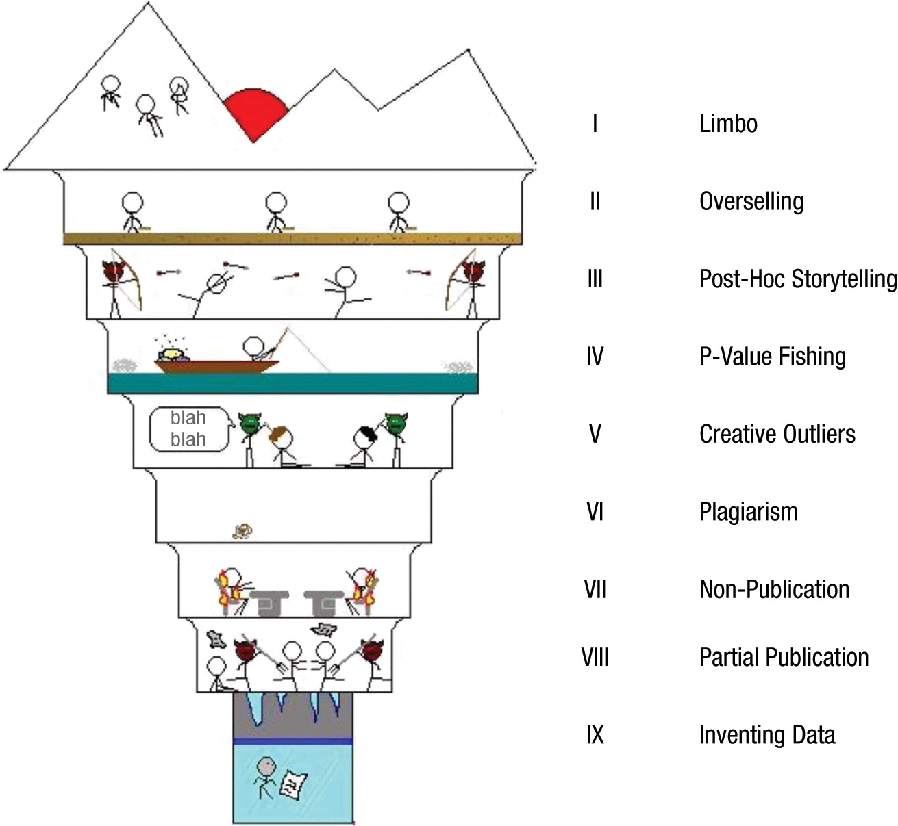

## *Outline*

* Strategi memilih jurnal yang tepat
* Integritas riset dan etika publikasi
* Manajemen data penelitian (*research data management*)
* Latihan menulis: *scientific sell*
* Menggunakan LLM dalam riset dan penulisan

# Strategi memilih jurnal yang tepat {background-color="#14497F" .center}

## Prinsip dasar: kenali jurnal sebelum *submit*

::: {.incremental}
* Membaca ***aims & scope*** jurnal **dengan serius** — bukan formalitas yang dilewati
* Telusuri artikel yang diterbitkan **2–3 tahun terakhir**: apakah topik Anda relevan?
* Perhatikan **gaya penulisan** dan **struktur** naskah yang diterima di jurnal tersebut
* Cek ***author guidelines*** dengan cermat sebelum mulai menulis atau merevisi
* **Satu naskah — satu jurnal** pada satu waktu (*no simultaneous submissions*)
:::

::: {.callout-warning}
**Penting**: *Submit* ke jurnal yang *scope*-nya tidak cocok = hampir pasti *desk reject*. Editor bisa langsung melihat ini.
:::

## 4️⃣®️ dalam memilih jurnal

::: {.incremental}
* **_Relevance_** — apakah topik Anda benar-benar sesuai dengan *scope* jurnal?
* **_Reach_** — siapa pembaca jurnal tersebut? Apakah sesuai audiens yang Anda tuju?
* **_Reputation_** — bagaimana persepsi komunitas ilmiah terhadap jurnal ini? (bukan hanya *impact factor*)
* **_Realism_** — apakah naskah Anda kompetitif untuk jurnal tersebut?

::: {.callout-note}
**Bonus R**: **_Resources_**

Berapa APC yang harus dibayarkan? Apakah ada *fee waiver* untuk peneliti dari negara berkembang? Cek dulu, karena banyak jurnal yang menyediakan _waiver_ tapi tidak disebutkan secara eksplisit.
:::
:::

## Metrik bukan ukuran kualitas — hanya heuristik

::: {.incremental}
* ***Impact Factor* (JIF)**, *quartile* Scopus (Q1–Q4), dan *h-index* adalah **metrik prestise** — bukan ukuran kualitas artikel secara langsung
* Fungsi praktisnya: membantu **seleksi awal** target jurnal untuk keperluan PAK atau promosi jabatan
* Yang lebih penting untuk dijadikan dasar:
  * Apakah komunitas yang Anda tuju **membaca** jurnal ini?
  * Apakah jurnal ini **menerbitkan artikel sejenis** dengan naskah Anda?
  * Berapa lama **proses *review*-nya** biasanya?
:::

::: {.callout-note}
#### Rekomendasi yang sering diberikan peneliti senior 
***"Submit* di jurnal yang Anda sitir."** Jika jurnal tersebut sudah muncul di daftar pustaka Anda, berarti komunitas pembacanya memang relevan dengan topik riset Anda.
:::

## Pertimbangan proses editorial

::: {.incremental}
Selain *scope*, perhatikan hal-hal ini sebelum memutuskan:

* ***Cakupan (scope)***: baca dengan cermat, jangan hanya mengandalkan nama jurnal
* **Dewan editor (*editorial board*)**: apakah ada pakar di bidang Anda? Dari institusi terkemuka?
* **Daftar pustaka Anda**: *submit where you cite* — jurnal yang Anda sitir adalah komunitas yang relevan
* ***Open research policy***: apakah jurnal mendukung *pre-registration*, *open data*, atau *Registered Reports*?
* **Rekomendasi kolega/promotor**: tanya kepada peneliti senior yang sudah berpengalaman *submit* ke jurnal tersebut
:::

::: {.callout-warning}
#### Hindari
...memilih jurnal hanya karena *quartile*-nya tinggi atau APC-nya terjangkau. Ketidakcocokan *scope* hampir selalu berakhir dengan *desk reject*.
:::

## Strategi khusus untuk *review articles*

::: {.incremental}
* *Scoping* dan *systematic review* punya masih punya tempat di komunitas ilmiah, tetapi kompetisi juga ketat
  - Ada tren _scoping_ dan _systematic review_ lebih sulit diterbitkan karena ada lonjakan tipe artikel yang sama yang berasal dari [_paper mill_](https://theconversation.com/paper-mills-the-cartel-like-companies-behind-fraudulent-scientific-journals-230124)
* Sebelum menulis, lakukan **cek duplikasi**: apakah _review_ serupa sudah diterbitkan baru-baru ini?
  * Jika ya → naskah Anda harus punya **nilai tambah** yang jelas
* *Novelty* bisa datang dari: **populasi berbeda, konteks berbeda, periode lebih baru, metodologi lebih ketat**
  - Gunakan strategi _systematic search_ meskipun untuk _scoping review_
* Beberapa jurnal punya ***section* khusus** untuk _review articles_, jadi prioritaskan jurnal-jurnal ini
:::

::: {.callout-note}
#### Tips 
Daftarkan protokol review Anda di [**PROSPERO**](https://www.crd.york.ac.uk/prospero/) sebelum mulai pengumpulan data. Ini meningkatkan kredibilitas dan sangat diapresiasi oleh *reviewer*.
:::

## Faktor-faktor yang sering dilupakan

::: {.incremental}
* ***Turnaround time***: berapa lama biasanya dari *submit* hingga keputusan pertama?
  * Cek di website jurnal atau tanya kolega yang pernah *submit* ke jurnal tersebut
* **APC dan *waiver***: banyak jurnal OA bereputasi menyediakan *waiver* untuk penulis dari negara berpenghasilan menengah-bawah
  * Selalu **tanyakan *waiver*** jika tersedia
* ***Submission charge***: 🔴**RED FLAG**🔴 — jurnal dengan pengelolaan yang baik tidak meminta biaya **sebelum** *peer-review*
* **Komunikasi editorial**: apakah email selalu dijawab? Apakah ada kontak editorial yang jelas?
:::

## *Cover letter* — hal pertama yang editor baca

::: {.incremental}
* *Cover letter* adalah **kesan pertama** — editor membacanya sebelum membuka naskah
* *Cover letter* yang baik berisi:
  * **Judul dan jenis artikel** yang diajukan
  * **Pernyataan singkat** tentang apa yang dilakukan dan mengapa relevan untuk jurnal tersebut
  * **Kontribusi utama** dalam 2–3 kalimat — apa *novelty*-nya?
  * **Konfirmasi** bahwa naskah tidak sedang disubmit ke jurnal lain (*no simultaneous submission*)
  * **Konfirmasi** kelayakan etik (*ethical clearance*) hanya jika relevan
* Sebutkan secara **eksplisit mengapa naskah ini cocok** untuk jurnal yang dituju
:::

::: {.callout-note}
#### Sebenarnya🙈
Editor tidak pernah membaca _cover letter_🙃 Fokuskan energi Anda untuk menyiapkan naskah. _Cover letter_ dapat ditulis oleh LLM.
:::

## Saat menerima *review*: jangan langsung dibalas

::: {.incremental}
* Menerima *review* — apalagi yang keras — bisa memicu reaksi emosional yang wajar
* **Tunggu 1–2 hari** sebelum mulai merespons
* Baca **semua** komentar *reviewer* terlebih dahulu, baru mulai menyusun respons
* Identifikasi: mana yang valid, mana yang perlu klarifikasi, mana yang tidak Anda setujui
* **Jangan pernah membalas dengan nada defensif atau emosional** — bahkan jika *reviewer* keliru. Tunjukkan kekeliruan _reviewer_ dengan bukti yang memadai.
* Ingat: *reviewer* menyumbangkan waktunya **secara sukarela** tanpa imbalan untuk membaca dan meninjau naskah kita
:::

## Merespons *reviewer* dengan baik

::: {.incremental}
* *Response to reviewers* adalah **keterampilan tersendiri** yang harus dipelajari
* Prinsip dasar: **_copy-paste_ komentar reviewer, jawab, lalu kutip revisinya di naskah**
  - **Tunjukkan dengan jelas** di mana dan bagaimana Anda merespons
* Setiap komentar *reviewer* harus direspons — tidak ada yang boleh diabaikan
* Jika tidak setuju dengan *reviewer*: boleh, tapi **wajib** berikan argumen yang kuat dan berdasar
* *Major revision* bukan penolakan — ini kesempatan untuk memperbaiki naskah
* Berikut contoh _response to reviewers_ yang paling panjang yang pernah saya tulis
  - **Contoh 1**: [Zein, R. A., Heene, M., & Gollwitzer, M.](/slides/libs/response_letter_firstround_final.pdf) (2025). Stage 2 Registered Report: Measuring How Individuals Relate Science to Religion. The International Journal for the Psychology of Religion. https://doi.org/10.1080/10508619.2025.2535033.
  - **Contoh 2**: [Zein, R. A. & Akhtar, H.](/slides/libs/response_letter_final.pdf) (2025). Getting Started with the Graded Response Model (GRM): An introduction and tutorial in R. International Journal of Psychology, 60(1), e13265. https://doi.org/10.1002/ijop.13265
:::

# Integritas riset dan etika publikasi {background-color="#14497F" .center}

## [*The nine circles of scientific hell*](https://journals.sagepub.com/doi/10.1177/1745691612459519)

:::: {.columns}
::: {.column}
::: {.incremental}
Dari yang "paling ringan" hingga paling berat:

1. **Limbo** — tidak mempublikasikan hasil penelitian
2. **Overselling** — mengklaim lebih dari yang didukung data
3. **Post-hoc storytelling** — narasi yang dibuat _post hoc_ setelah melihat data
4. **P-value fishing** — mencari-cari p < .05 dengan berbagai cara
5. **Creative outliers** — membuang data _outlier_ tanpa justifikasi yang jelas
:::
:::
::: {.column}
::: {.incremental}

{fig-align="center"}

:::
:::
::::

## [*The nine circles of scientific hell*](https://journals.sagepub.com/doi/10.1177/1745691612459519)

:::: {.columns}
::: {.column}
::: {.incremental}
Dari yang "paling ringan" hingga paling berat:

6. **Plagiarism** — menyalin tanpa atribusi yang benar
7. **Non-publication** — sengaja menyembunyikan hasil negatif (*publication bias*)
8. **Partial publication** — *salami slicing*
9. **Inventing data** — fabrikasi atau falsifikasi data
:::
:::
::: {.column}
::: {.incremental}

{fig-align="center"}

:::
:::
::::

## *Overselling*

::: {.incremental}
* Mengklaim lebih dari yang didukung data adalah *misconduct* yang **paling umum** — dan sering tidak disadari
* Contoh *overselling* dalam *review articles*:
  * *"Belum ada penelitian yang membahas ini"* → padahal ada, hanya belum dibaca dengan cermat
  * *"Penelitian ini membuktikan bahwa X menyebabkan Y"* → review bukan RCT, tidak bisa klaim kausalitas
  * *"Temuan ini akan mengubah cara pandang dunia"* → terlalu berlebihan untuk diklaim
* Konsekuensi: **berkontribusi pada *replication crisis*** dan menyesatkan pembaca
:::

::: {.callout-warning}
#### Ingat
Perbedaan kecil dalam pilihan kata punya dampak besar. *"Studi ini mengeksplorasi..."* ≠ *"Studi ini membuktikan..."*
:::

## *Hedging language* yang tepat

| ⛔Hindari⛔ | ✅Gunakan✅ |
|---|---|
| *"membuktikan bahwa..."* | *"mengindikasikan bahwa..."* / *"konsisten dengan..."* |
| *"belum ada penelitian..."* | *"sejauh yang diketahui peneliti..."* |
| *"akan mengubah..."* | *"berpotensi berkontribusi pada..."* |
| *"semua..."* | *"sebagian besar partisipan dalam studi ini..."* |
| *"selalu terjadi..."* | *"cenderung terjadi dalam konteks..."* |

: {tbl-colwidths="[38,62]"}

## Etika publikasi yang perlu diperhatikan

::: {.incremental}
* **Kepengarangan (*authorship*)**: hanya cantumkan nama yang benar-benar **berkontribusi secara substansial**
  * *Ghost authorship* dan *gift authorship* adalah pelanggaran etika yang serius
* **Plagiarisme**: parafrase bukan menyalin. Setiap ide yang bukan milik Anda **harus diatribusikan**
* ***Ethical clearance***: semakin banyak jurnal internasional mensyaratkan ini, bahkan untuk *review articles* (*PRISMA-P*)
  - Meskipun begitu, perlu/tidaknya _ethical clearance_ sangat tergantung pada kebijakan institusi
* **Peran promotor**: supervisor memiliki tanggung jawab etik dalam proses publikasi mahasiswanya, bukan hanya formalitas pencantuman nama
  - Umumnya, penelitian doktoral adalah **penelitian mandiri** yang dilakukan oleh mahasiswa, bukan penelitian kolaborasi dengan promotor/ko-promotor
  - **Diskusikan secara terbuka** dengan promotor/ko-promotor tentang kontribusi dan peran masing-masing dalam penulisan artikel
  - Jangan menambahkan nama promotor/ko-promotor **tanpa persetujuan** sebelumnya
:::

## Konteks lebih luas: krisis replikasi

::: {.incremental}
* Studi besar (*Many Labs* 1, [Open Science Collaboration 2015](https://www.science.org/doi/abs/10.1126/science.aac4716)) menunjukkan: **hanya ~36% klaim ilmiah di psikologi** yang berhasil dicoba-ulang
* Studi terbaru (_project_ SCORE, [Tyner et al., 2026](https://www.nature.com/articles/s41586-025-10078-y)) menunjukkan bahwa **lebih dari separuh (55.1%) klaim ilmiah** yang diterbitkan di jurnal-jurnal ilmu sosial dan perilaku, dalam kurun waktu 2009-2018, dapat dicoba-ulang
* Penyebab utama: *publication bias* (hanya hasil positif yang diterbitkan), *p-hacking*, *overselling*, desain penelitian yang lemah
* Implikasinya untuk kita sebagai penulis *review*:
  * **Hati-hati** dengan menarik kesimpulan dari satu studi 
  * Pertimbangkan **kualitas metodologi** studi yang Anda review, bukan hanya jumlahnya
  * Prinsip *open science* (e.g., transparansi, kredibilitas, coba-ulang - _replication_, dan reka-ulang - _reproducibility_) saat ini merupakan tren global dan sudah menjadi norma baru
:::

## *Open science* untuk penulis *review*

::: {.incremental}
* **Daftarkan protokol** _review_ Anda di PROSPERO atau OSF *sebelum* pengumpulan data
* **Laporkan proses sedetail mungkin** — termasuk studi yang tidak memenuhi kriteria, dan mengapa
* Gunakan ***checklist* PRISMA** dengan jujur dan lengkap
* **Bagikan data ekstraksi** (*data extraction sheets*), jika memungkinkan, sebagai bentuk komitmen pada prinsip *open data*
  - Kalau menggunakan _software systematic review managemen_ seperti [ASReview](https://asreview.nl/) atau [Rayyan](https://www.rayyan.ai/), maka jelaskan [_stopping rules_](https://onlinelibrary.wiley.com/doi/full/10.1002/jrsm.1762)-nya
* **Laporkan *heterogeneity*** dengan transparan, bukan hanya *pooled effect size estimate*
:::

::: {.callout-note}
#### *Open science* meningkatkan peluang diterimanya artikel
Praktik *open science* bukan hanya soal etika penelitian, tetapi juga meningkatkan **peluang diterima** di jurnal bereputasi baik, yang hari ini, banyak yang meminta penulis mengadopsi prinsip _open science_.
:::

# Manajemen data penelitian {background-color="#14497F" .center}

## Apa itu *research data management* (RDM)?

::: {.incremental}
* RDM adalah praktik terstruktur dalam **mengorganisasi, mendokumentasikan, menyimpan, dan berbagi** data penelitian sepanjang siklus hidupnya
* Untuk penulis *review articles*, "data" mencakup lebih dari sekadar angka:
  * **Search string** dan strategi penelusuran yang digunakan
  * **Keputusan inklusi/eksklusi** (*screening decisions*) di setiap tahap
  * ***Extraction sheet*** — tabel ekstraksi data dari setiap studi yang dimasukkan
  * **PRISMA flow diagram** beserta jumlah studi di setiap tahap
* Prinsip panduan: **FAIR** — data harus *Findable, Accessible, Interoperable, Reusable*
:::

::: {.callout-note}
RDM bukan hanya formalitas — data yang terdokumentasi dengan baik memungkinkan *review* Anda **direplikasi, diperbarui, dan disitasi** oleh peneliti lain.
:::

## *Open data policy*

::: {.incremental}
**Tiga level kebijakan yang umum**:

* **Wajib (*required*)** — data harus dideposit sebelum artikel diterbitkan
* **Didorong (*encouraged*)** — tidak wajib, tapi sangat disarankan dan diberi badge
* **Tidak disyaratkan** — masih umum di sebagian jurnal, tapi tren bergeser ke arah transparansi

**_Platform_ deposit data yang umum digunakan**:

* [**OSF**](https://osf.io) — paling sering digunakan oleh peneliti psikologi
* [**Zenodo**](https://zenodo.org) — mendukung berbagai format, DOI otomatis
* [**figshare**](https://figshare.com) — untuk tabel, gambar, dan dataset pelengkap
* **Repositori institusi** — cek apakah UNAIR menyediakan

::: {.callout-warning}
#### Penting
Sebelum *submit*, baca bagian ***data availability statement*** di *author guidelines*. Banyak jurnal bereputasi baik kini mensyaratkan pernyataan ini di dalam naskah, bahkan jika data tidak dapat dibagikan secara publik, alasannya harus dijelaskan secara eksplisit.
:::
:::

## TUGAS 2️⃣: *Scientific Sell* (25 menit)

Tuliskan **1 paragraf (150–200 kata)** yang menjawab:

::: {.incremental}
1. Mengapa topik riset Anda (yang sudah dibahas di Tugas 1️⃣) **relevan** secara ilmiah DAN praktis?
2. Mengapa komunitas ilmiah dan/atau pembuat kebijakan perlu **peduli** dengan pertanyaan penelitian Anda?
3. Apa yang **belum diketahui** yang ingin Anda ungkap?
4. Tuliskan tugas Anda di [halaman Padlet ini](https://padlet.com/ameliazein/berlatih-menulis-xcpa9ybswkvfuvlt)
:::

:::: {.columns}
::: {.column}
::: {.callout-warning}
**Hindari** ❌

* *"Belum ada yang meneliti ini..."*
* *"Penelitian ini akan membuktikan..."*
* Angka yang tidak ada sumbernya
* Klaim adanya efek sebelum data dikumpulkan/dianalisis
:::
:::
::: {.column}
::: {.callout-note}
**Gunakan** ✅

* Angka/fakta yang bisa diverifikasi
* Sitasi penelitian sebelumnya
* *Hedging*: "mengindikasikan...", "cenderung...", "dalam konteks..."

:::
:::
::::

# Menggunakan LLM🤖 {background-color="#14497F" .center}

## Menggunakan LLM untuk meneliti dan menulis

::: {.incremental}
* *Large Language Model* (LLM) seperti ChatGPT, Gemini, dan Claude kini umum digunakan, termasuk di komunitas akademik.
* LLM **dapat membantu** untuk:
  * Memperbaiki tata bahasa dan gaya penulisan
  * Menerjemahkan teks
  * Membantu analisis dan visualisasi data
* **Namun**: artikel ilmiah **harus ditulis oleh penelitinya sendiri**
  * Isi, argumen, dan interpretasi adalah tanggung jawab penuh penulis
  * Banyak jurnal kini mensyaratkan *disclosure* atas penggunaan AI
:::

::: {.callout-warning}
#### Penting
Menggunakan LLM untuk *menulis* naskah Anda secara keseluruhan, bukan hanya membantu perbaikan, dapat dikategorikan sebagai pelanggaran integritas akademik. Gunakan LLM sebagai _asisten_ (bukan penulis utama) dan laporkan secara transparan.
:::

## _LLM-based software_ yang [membantu saya](https://ameliazein.notion.site/Tinjauan-literatur-terstruktur-d6f40a3a7b7f45efbad1c2cff6e3c418?source=copy_link)

::: {.incremental}

* [Claude Code](https://code.claude.com/docs/en/overview)
  - Digunakan sebagai _coding assistant_ dan otomatisasi _workflow_

* [ChatPDF](https://www.chatpdf.com/) ➡️ Cocok untuk mempelajari satu literatur (dalam 1 file .pdf) secara mendalam 

* [Research Rabbit AI](https://app.researchrabbit.ai/) ➡️ Membantu melihat keterkaitan antara satu artikel/literatur dengan literatur yang lain melalui data sitasi

* [ScienceOS](https://www.scienceos.ai/) ➡️ dapat digunakan untuk mempelajari beberapa dokumen pdf sekaligus secara interaktif 
  - Model LLM sudah di*fine-tune* agar lebih responsif dengan konteks saintifik

:::

## Ada pertanyaan❓

{fig-align="center"}

::: {.callout-note}
* Paparan disusun dengan menggunakan [**Quarto**](https://quarto.org) dengan *template* dari [UNAIR Theme](https://github.com/rameliaz/quarto-unair-theme).
* Kontak saya via  <a href="mailto:amelia.zein@psikologi.unair.ac.id">amelia.zein@psikologi.unair.ac.id</a>
:::
